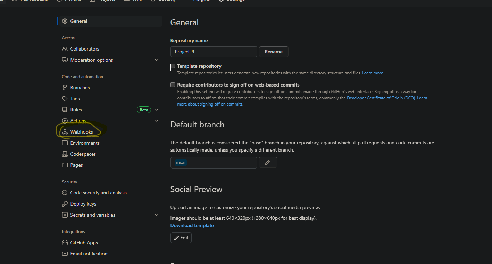
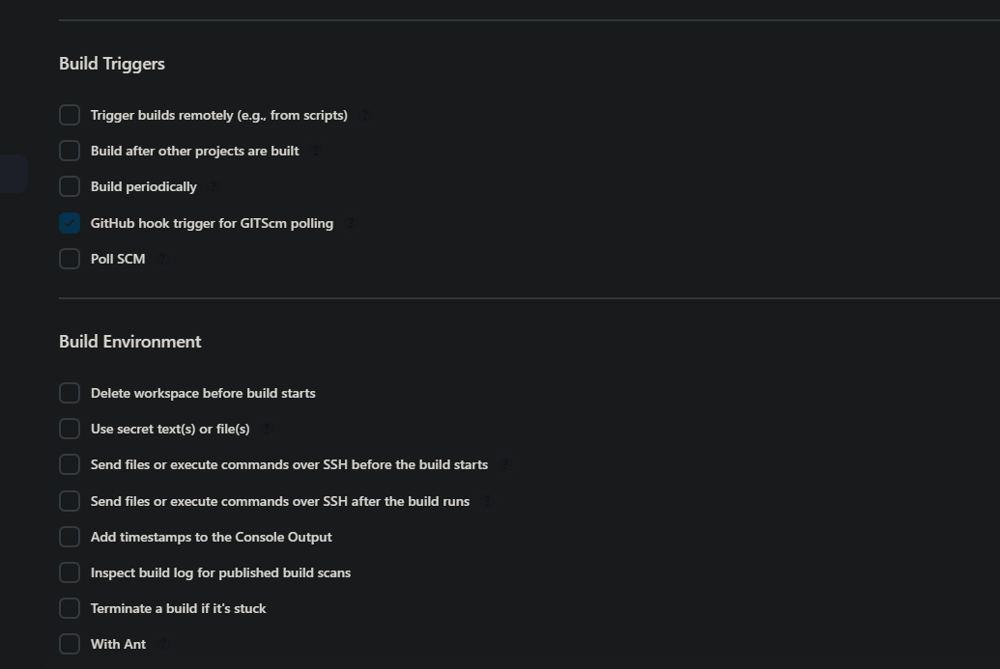
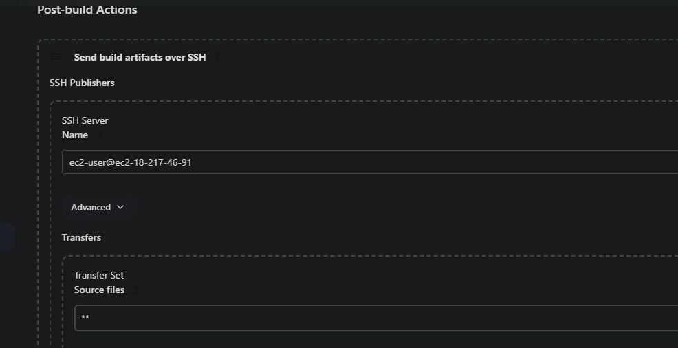

# Project-9

## The prior project (workplace-8) is carried out in conjunction with this one.

## Project's main goal

DevOps is about agility and speedy release of software and web solutions. To guarantee fast and repeatable deployments, automation of routine tasks is essential. Jenkins is a free and open source automation server created by Kohsuke Kawaguchi.This project's goal is to promote the idea of automating everyday operations in DevOps and use of Jenkins, a well-known open source automation server, to automate our Tooling Website's deployment process. Continuous integration (CI) is a software development strategy that increases speed and ensures quality code deployment. Jenkins CI capabilities are used to automatically update source code in GitHub.

## Installation and configuration of Jenkins server

The architecture of the proposed solution is depicted in the figure below.
 
 

 ## Step 1 -Install Jenkins Server
 Launch an AWS EC2 server based on Ubuntu Server and you can give it any name you like.

1. You can provide any name you like to the AWS EC2 server you create using Ubuntu Server.

2. Jenkins is a Java application, so you should install JDK.

`sudo apt update`

`sudo apt install default-jdk-headless`

3. Installation of Jenkins

`wget -q -O - https://pkg.jenkins.io/debian-stable/jenkins.io.key | sudo apt-key add -`

`sudo sh -c 'echo deb https://pkg.jenkins.io/debian-stable binary/ > \  /etc/apt/sources.list.d/jenkins.list'`

`sudo apt update`

`sudo apt install jenkins`

Make sure your Jenkins is running by checking its status.

`sudo systemctl status jenkins`

NOTE: If you have trouble installing Jenkins, you can visit the official Jenkins website. New versions may affect the setup shown above. Run the following commands if you'd like.

`curl -fsSL https://pkg.jenkins.io/debian/jenkins.io-2023.key | sudo tee \ /usr/share/keyrings/jenkins-keyring.asc > /dev/null`

`echo deb [signed-by=/usr/share/keyrings/jenkins-keyring.asc] \ https://pkg.jenkins.io/debian binary/ | sudo tee \ /etc/apt/sources.list.d/jenkins.list > /dev/null`

`sudo apt install openjdk-11-jre`

`sudo apt-get update`

``sudo apt-get install jenkins`

Check the status after that.

`sudo systemctl status jenkins`

4. Create an inbound rule in the ec2 security group to open port 8080 because enkins work on tis port.

Jenkins setup requires providing a default admin password.

From your browser, access jenkins with

http://<jenkins-public-server-IP-Address>:8080. This will take you to the default admin password page

Run this command `sudo cat /var/lib/jenkins/secrets/initialAdminPassword` to retrieve default password to Jenkins server.

Copy password and paste to install suggested plugins.

Create admin user and password to use Jenkins.

## Step 2 Jenkins job/project will retrieve source codes from GitHub using webhooks.

Open the repository containing your work by logging into your Github account. Select "webhooks" under "Settings"

Then click "add webhook" after entering http://jenkins-server-public-IP-address>:8080/github-webhook/ into the payload url field and selecting JSON as the content type.

2. Create a 'freestyle project' in Jenkins web console.

Provide GitHub repository's URL to connect. Then, Jenkins needs Git repository link and credentials to access files.

Click on add "Post-build Actions" to archieve all the files.

Click configure to set your build triggar if the job was successfully built. Go down to "Build Triggars" and choose "Github hook triggar for GITScm polling"

Click on add "Post-build Actions" to archieve all the files.

Your artifacts are presently saved on Jenkins' server. Therefore, the artifact file must be uploaded to the NFS server's /mnt/apps directory.

Install the "publish over ssh" plugin on your computer in order to accomplish this.

To manage plugins, select "Manage Plugins" from the "Manage Jenkins" menu on your Jenkins server. To check it, click available, then type "publish over ssh" in the search box. Click Install without restart after that.

Go back to your dashboard and select "Manage Jenkins" and "System Configuration" once more. The new plugin you installed is down there; make your way there.

You can paste your NfS server's.pem key in the Key field by copying it. Give the "SSH Server Name" any name at this point. The "Hostname" box should include your NFS private IP address. The NFS directory where the artifacts will be transmitted (in this case, that will be /mnt/apps) should also be entered, along with the username of the NFS server. In order to verify that your setting is accurate, click on test configuration.

Afterward, return to the task setup and choose a different post-build action by clicking "Add post-build action" and choosing "Send build artifacts over SSH" and saving.

once this has been completed. Return to your terminal and launch the NFS server there. To allow the artifact file to be sent into your `/mnt/apps` permission, you must change the mode of the permission.

Run the following commands after connecting your NFS instance and opening the console.

`sudo chmod -R 777 /mnt/apps sudo chown -R nobody:nobody /mnt/apps`

once this has been completed. Return to your terminal and launch the NFS server there. To allow the artifact file to be sent into your /mnt/apps permission, you must change the mode of the permission.

Run the following commands after connecting your NFS instance and opening the console.

`/mnt/apps sudo chmod -R 777 /mnt/apps sudo chown -R nobody:nobody`

Return to your git repository after this is finished and create a new commit. Next, look for a new build in your Jenkins. If successful, an automatic transfer of the artifact file to the `/mnt/apps` directory will take place.

